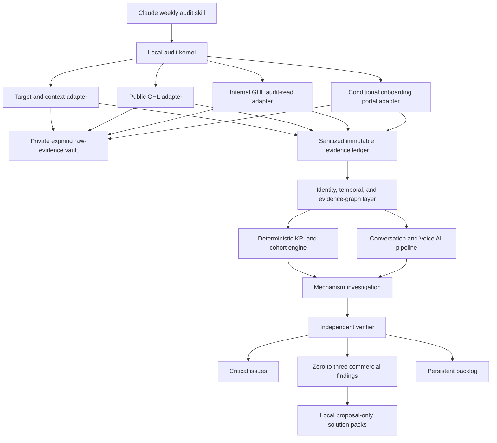

# Weekly Whole-Account GHL Auditor Design

**Status:** Approved design
**Date:** 2026-07-24
**Implementation target:** `skills/ghl-account-audit`
**Primary operating model:** One project and one GHL location per run

## 1. Purpose

Evolve the existing `ghl-account-audit` skill from a primarily capture, verification, and harvesting tool into a weekly commercial diagnostic.

The auditor must behave like a senior cross-functional account analyst. It should reconstruct how the account currently operates, measure the commercial journey, locate material leaks, investigate the mechanisms behind them, and produce implementation-ready local solutions.

The product is not successful when it merely restates account configuration or reports declining percentages. It is successful when a reviewer can understand:

1. What the system is intended to do.
2. What the system actually did.
3. Where commercial value was lost.
4. Which mechanism most credibly produced that loss.
5. What exact change should be considered.
6. How that change would be tested, monitored, and reversed.

## 2. Product decisions

- Evolve `ghl-account-audit`; do not create a separate competing auditor.
- Preserve the existing `capture`, `verify`, and `harvest` modes.
- Add a `weekly` diagnostic mode.
- Run independently for one project and one GHL location.
- Support client locations and Grom's own GHL location through separate operating profiles.
- Run weekly against closed periods, with trailing and mature-cohort context.
- Require public and internal GHL evidence for a full whole-account audit.
- Treat public-only analysis as partial and explicitly bounded.
- Treat the Grom onboarding portal as a separate conditional evidence surface.
- Exclude GHL Courses, lessons, course offers and progress, Memberships, Communities, Assessments, Certificates, and course credentials.
- Produce zero to three implementation-ready commercial solution packs, plus every evidenced critical issue.
- Store all proposed changes locally.
- Require explicit human approval through a separate, content-bound receipt before execution.
- Keep the diagnostic auditor structurally read-only.

## 3. Scope

### 3.1 Client operating profile

A client run audits that location's declared commercial journey. A typical journey is:

```text
source
→ lead created
→ first response
→ qualified
→ booked
→ showed or no-showed
→ opportunity
→ won or lost
→ collected revenue
→ rebooking or retention, when supported
```

The actual stages are account-defined. The auditor must not invent stages that do not exist in the client's sales motion.

### 3.2 Grom internal operating profile

Grom's own GHL location contains two independent journeys.

#### Agency new business

```text
enquiry
→ contacted
→ qualified
→ strategy or sales call
→ showed or no-showed
→ proposal or decision
→ won or lost
→ collected revenue
```

#### Client onboarding and fulfillment

```text
won or paid
→ internal handoff
→ portal or project activation
→ access and assets requested
→ assets complete
→ strategy or design approved
→ build
→ QA
→ client approval
→ launch
→ early support or first-value milestone
```

These journeys have separate entry rules, denominators, clocks, KPIs, owners, and outcomes. A signed-client handoff is an explicit edge between them.

Every event belongs to a `journey_instance_id`. Contact identity alone must not mix prospect engagement with onboarding activity.

### 3.3 Explicit non-goals

- GHL agency control-plane auditing beyond a location-level account
- Automatic live remediation
- Self-modifying KPI rules or scoring weights
- GHL Courses, lessons, course offers and progress, Memberships, Communities, Assessments, Certificates, and course credentials
- Treating the onboarding portal as a GHL course portal
- Claiming point-in-time snapshot isolation across APIs
- Guaranteed causal attribution or revenue improvement
- Replacing human approval for commercial definitions or live changes

## 4. Target and context contract

Every run begins with a versioned target descriptor:

```yaml
target_kind: location
operating_profile: client | grom_internal
company_id: optional
location_id: required
context_providers:
  - onboarding_portal
  - client_project
  - agency_project
```

The business-context snapshot defines:

- Account identity, timezone, and currency
- Ideal customer profile and offers
- Lead-source taxonomy
- Pipeline and stage semantics
- Qualification, booking, show, win, loss, and revenue definitions
- Response, follow-up, and sales-cycle expectations
- Cohort maturity periods
- Attribution rules
- Exclusions for tests, staff, spam, duplicates, and legacy imports
- Estimated commercial value when collected revenue is unavailable
- Declared targets and capacity constraints

Context providers are pluggable:

- Client locations use approved onboarding-portal facts and client project or design files.
- Grom's own location uses agency strategy and operating documents, plus the onboarding portal for the onboarding journey when joinable.

Authority order is field-specific and versioned. In general:

1. Approved context defines commercial intent.
2. Project registries and designs define intended implementation.
3. Live GHL evidence defines actual account state.

Conflicts are preserved and reported. Missing commercial definitions produce `UNKNOWN`, not invented rules.

## 5. Architecture

`SKILL.md` remains a thin Claude-facing interface over one local Node process.



The adapters are interfaces inside the local process, not autonomous agents or microservices.

The skill is responsible only for:

- Resolving the project and target
- Selecting the run mode
- Starting or resuming the kernel
- Showing status and coverage
- Requesting an internal credential refresh when required
- Presenting the published report, backlog, and solution packs

The kernel owns orchestration, retries, pagination, checkpoints, normalization, metrics, ranking, persistence, and verification.

### 5.1 Version-one module boundary

Keep version one as one local Node process with testable internal modules:

```text
skills/ghl-account-audit/
├── SKILL.md
├── cli/
│   └── audit.mjs
├── lib/
│   ├── kernel.mjs
│   ├── state.mjs
│   ├── adapters/
│   │   ├── context.mjs
│   │   ├── public-ghl.mjs
│   │   └── internal-ghl.mjs
│   ├── normalize.mjs
│   ├── analyze.mjs
│   ├── artifacts.mjs
│   ├── memory.mjs
│   └── modes/
│       ├── weekly.mjs
│       ├── capture.mjs
│       ├── verify.mjs
│       └── harvest.mjs
├── schemas/
└── tests/
```

Do not add microservices, an event bus, a web application, vector storage, or autonomous surface agents in version one. Split modules further only when independent testing requires it.

## 6. Evidence adapters and coverage

### 6.1 Public GHL adapter

The public adapter covers documented account and outcome surfaces, including applicable:

- Contacts and sources
- Conversations and messages
- Calendars and appointments
- Pipelines and opportunities
- Forms and submissions
- Payments and invoices
- Conversation AI and Voice AI public surfaces
- Users, settings, integrations, funnels, tracking, and deliverability surfaces

One public provider is pinned for the complete run. Its identity and capability-manifest hash are recorded.

The auditor-facing public adapter enforces read-only scopes where the provider supports them and an exact operation-ID and capability-tuple allowlist before dispatch. A generic upstream execution tool is never exposed directly to the auditor. The policy proxy rejects mutation operation IDs even when the upstream MCP advertises them.

The public workflow inventory is not sufficient for a full workflow audit because it does not expose complete workflow graphs or runtime behavior.

### 6.2 Internal GHL adapter

The internal adapter is mandatory for full workflow-dependent coverage. It owns:

- Workflow roster, version, status, and update time
- Complete workflow definitions
- Triggers, branches, waits, exits, and referenced objects
- Date-bounded execution logs
- Complete enrollment history
- Per-step counts
- Step rosters for anomalous steps
- Internal AI configuration when public representations are insufficient
- Other typed internal read surfaces promoted into the applicable coverage profile

The latest internal OpenAPI YAML is a capability specification, not runtime proof. A documented endpoint becomes eligible for mandatory coverage only after it has a dedicated typed handler and passes live read-only verification.

The target runtime operation is equivalent to:

```text
get_workflow_runtime_window(
  locationId,
  workflowId,
  fromDate,
  toDate,
  optional contactId,
  optional eventTypes
)
```

It must return:

- Requested and applied windows
- Timezone and boundary semantics
- Event-time field and late-arrival policy
- Workflow definition and version hash
- Runtime events
- Complete enrollments
- Per-step counts and relevant step rosters
- Enrollment totals
- Pagination or cursor ledger
- Reported, collected, and unique record counts
- Terminal-page proof
- `complete`, `truncated`, and rate-limit state
- Capture time, source route, capability version, and bound `locationId`

The adapter rejects insufficient contract versions. It never falls back to `raw_request`.

### 6.3 Onboarding portal adapter

The onboarding portal is a separate read-only adapter. It may provide:

- Client and project identity
- Access and asset readiness
- Strategy and design approvals
- Onboarding blockers
- Build and launch milestones
- First-value or early-support milestones when available

Portal facts stay in their own evidence namespace. They are joined to GHL only through an explicit validated client, company, opportunity, or project identifier. Fuzzy names or email matches may create a candidate link but cannot prove a journey transition.

Missing portal evidence affects the onboarding journey only. It does not weaken the Grom new-business journey.

### 6.4 Versioned coverage profile

Each operating profile has a machine-readable coverage profile that classifies capabilities as:

- Required
- Conditional
- Optional
- Excluded

Each applicable scope finishes as:

- `COMPLETE`
- `INCOMPLETE`
- `UNAVAILABLE`
- `STALE`
- `NOT_APPLICABLE`
- `INVALID`

Coverage is recorded per source, journey edge, KPI, verdict dimension, and comparison window.

A run may be `complete_full` only when:

- Every required and applicable conditional capability is `COMPLETE` for every required window.
- Pagination, totals, location binding, and freshness invariants pass.
- Capability manifests, code, context, and ruleset hashes are valid.
- The privacy scan passes.
- The independent verifier passes.
- The tool trace contains zero write and `raw_request` attempts.
- No published claim depends on stale evidence.

Trustworthy incompleteness produces `complete_partial`. Integrity failure produces `quarantined`. A `blocked`, `failed`, or `quarantined` run cannot publish findings or solution packs.

Missing internal workflow evidence makes workflow-dependent coverage partial, even when the public rail completes.

## 7. Read-only, privacy, and integrity boundaries

### 7.1 Structural read-only profile

The audit profile registers exact typed capabilities only.

It must not expose:

- `raw_request`
- Workflow, AI, contact, opportunity, calendar, or message mutations
- Send, publish, trigger, fast-forward, delete, or removal operations
- Mutation tools that also contain a read path
- A confirmation bypass

Read-only enforcement is semantic, not based only on HTTP method. Some safe searches use `POST`, while an endpoint should not be trusted merely because it uses `GET`.

Both rails use:

- Exact `{host, method, normalizedPath, authRail}` allowlists
- Read-only or least-privilege credentials where the provider supports them
- Location binding on requests and responses
- One shared throttle and circuit breaker
- Tool-call trace inspection

When the internal rail requires a broader short-lived administrative credential, isolate and host-pin it, minimize its lifetime, enforce the same exact capability allowlist and location binding, and record the elevated-credential condition in coverage metadata.

An attempted write or cross-location response quarantines the run.

### 7.2 Evidence separation

The immutable ledger contains:

- Aggregates
- Pseudonymous keyed identifiers
- Provenance
- Coverage and pagination metadata
- Content hashes
- KPI and finding lineage

Raw PII, message bodies, transcripts, or recordings required for analysis use a separate encrypted, access-controlled, expiring vault. The ledger retains only the raw artifact hash and opaque locator.

Every raw-vault item records `expiresAt`, deletion state, and purge-check result. Expiry creates an immutable `raw_evidence_expired` memory event instead of rewriting an old publication. Pseudonymization keys remain outside the repository, evidence ledger, and published artifacts.

Credentials, cookies, authorization headers, magic links, and provider secrets must never appear in published artifacts, checkpoints, SQLite, logs, or reports.

Sanitized evidence must pass:

1. Recursive secret scanning.
2. PII-minimization checks.
3. Repository-storage classification.
4. Manual review when free text or custom headers are present.

## 8. Run state and publication semantics

The logical run state machine is:

```text
queued
→ preflight
→ collecting_context
→ collecting_public
→ awaiting_internal_auth
→ collecting_internal
→ normalizing
→ analyzing
→ verifying
→ prioritizing
→ compiling
→ persisting
→ complete_full | complete_partial
```

Alternative terminal states:

- `blocked`: target, context, or required capability cannot be resolved safely.
- `failed`: non-recoverable collection or storage failure without integrity compromise.
- `quarantined`: location mismatch, evidence corruption, manifest mismatch, verifier integrity failure, or attempted write.

One active lease is allowed per location. Pages and phases checkpoint atomically with their input and output hashes.

A resumed logical run retains its `run_id` only when the target, analytical cutoff and windows, timezone, context version, coverage profile, code and ruleset hashes, and capability manifests are identical. Otherwise the kernel starts a new run. A credential refresh may resume the logical run only while those frozen inputs remain unchanged.

Every resumed publication receives a new immutable `publication_id`. An earlier partial publication is never overwritten by a later full publication.

The latest partial publication must not replace the latest full publication as the normal comparison baseline.

If new internal evidence arrives after a partial publication:

- Downstream normalization and analysis are invalidated and rerun.
- Public evidence is refreshed when its freshness budget or snapshot-skew policy requires it.
- The new full publication supersedes but does not erase the partial publication.

Historical internal evidence is comparison evidence, not current-state proof.

## 9. Weekly diagnostic method

### 9.1 Preflight

The auditor:

1. Confirms the target, location, operating profile, timezone, and read-only access.
2. Loads and validates the commercial context.
3. Freezes the context version and analytical cutoff.
4. Determines applicable capabilities and coverage requirements.
5. Records context gaps before collection.

### 9.2 Analysis windows

The default weekly run uses complete account-local calendar weeks:

- Current closed week
- Previous closed week
- Trailing 28-day context
- Mature acquisition cohorts
- Pre-change and post-change windows for implemented solutions

The run starts on the first business day after the week closes, after a configurable data-settlement delay.

Two temporal views remain separate:

- Activity windows for replies, bookings, workflow events, handoffs, and stage movement
- Acquisition cohorts observed through their maturity period for win rate, revenue, and value per lead

Every KPI has a versioned contract defining:

- Numerator and eligible denominator
- Unit, timezone, and event-time field
- Inclusion and exclusion rules
- Deduplication and re-entry behavior
- Cancellation and reopened-opportunity treatment
- Maturity and right-censoring rules
- Attribution model
- Late-event and deletion policy
- Minimum sample and uncertainty rules

Rates always display raw numerators and denominators.

Small-volume results are treated conservatively. A rate-driven commercial ranking is not allowed when the metric's configured sample threshold is not met. A directly observed operational defect may still be promoted based on demonstrated mechanism and affected population, but it must not be extrapolated into an unsupported account-wide rate or revenue claim.

### 9.3 Evidence graph and journey reconstruction

The typed evidence graph includes nodes for:

- Context and intended strategy
- Contacts and organizations
- Ads, campaigns, forms, funnels, and sources
- Opportunities and stage transitions
- Appointments and dispositions
- Conversations, messages, calls, and handoffs
- Workflow definitions, versions, triggers, enrollments, steps, and executions
- AI agents, knowledge sources, and actions
- Payments and commercial outcomes
- Onboarding-portal milestones
- Staff ownership and tasks

Edges include:

- `identity_exact`
- `configured_to_trigger`
- `enrolled_in`
- `execution_emitted`
- `preceded`
- `attributed_by_source`
- `intended_by`
- `contradicts`
- `inferred_match`

Every edge records source evidence, join keys, event time, capture time, time tolerance, configuration version, and join confidence.

Join precedence is:

1. Direct native IDs.
2. Native execution or attribution metadata.
3. Deterministic composite keys.
4. Fuzzy matching as a candidate only.

Current workflow definitions must never be used as proof of what historical contacts experienced unless the effective version at the event time is known.

### 9.4 Adjacent-stage analysis

For every eligible transition `A → B`, calculate:

- Eligible population at A
- Number reaching B inside the allowed window
- Conversion rate
- Time-to-B distribution
- Stalled, exited, and unresolved counts
- Commercial value represented
- Current, previous, trailing, and mature-cohort comparison

Use both:

- Flow cohorts entering during a defined period
- Current stock state and stage dwell

Segments such as source, offer, owner, AI versus human, appointment type, or workflow are analyzed only where coverage and volume support interpretation.

### 9.5 Workflow and runtime diagnosis

Map each commercial journey edge to the workflows expected to create or support it.

Configuration review covers:

- Published or draft state
- Trigger and re-entry behavior
- Step graph and branch defaults
- Wait timing
- Assignment and ownership
- Stop and exit behavior
- DND and communication constraints
- Referenced templates, calendars, fields, tags, and agents
- Configuration changes since the comparison publication

Runtime review covers:

- Enrollment
- Step success, failure, and skips
- Per-step active-contact counts
- Wait-step backlogs
- Unexpectedly unused branches
- Contacts parked at material steps
- Expected versus observed execution

A correct-looking published workflow is configuration evidence only. It is not proof that eligible contacts enrolled or received the intended experience.

### 9.6 Conversation and Voice AI analysis

Define the complete interaction universe before sampling.

Always review:

- Complaints and opt-outs
- Failed handoffs
- Abandoned or failed calls
- Materially delayed responses
- High-value lost opportunities
- Interactions connected to candidate mechanisms

The versioned sampling contract defaults to a census when the eligible universe contains 50 or fewer interactions. Above that threshold, use a deterministic, reproducible sample, normally 30 to 50 interactions, stratified by time, source, stage, owner, outcome, response-time band, call-duration band, and handoff state. A profile may change the threshold only through a versioned ruleset.

The sampling seed, universe, strata, inclusion probabilities, and selected interactions are recorded.

Mandatory complaints, failures, handoff problems, and high-value losses may be deliberately oversampled for diagnosis. Their prevalence in the review sample must not be represented as population prevalence. Population-level estimates require recorded inclusion probabilities, appropriate weighting, and uncertainty bounds. Otherwise the conclusion remains explicitly sample-bounded.

The versioned rubric scores:

- Intent recognition
- Accuracy and relevance
- Qualification
- Objection handling
- Booking behavior
- Next-action clarity
- Handoff quality
- Tone and compliance
- Unresolved customer effort

Voice metadata can prove delivery or duration facts. Conversation-quality claims require a transcript, recording, or equivalent content.

### 9.7 Mechanism investigation

Each material anomaly becomes a mechanism packet:

- Measured symptom and denominator
- Affected journey and cohort
- Localized graph node or edge
- Successful comparator journeys
- Relevant configuration and runtime evidence
- Candidate mechanism
- Prediction if the mechanism is true
- Supporting and counterevidence
- Competing explanations
- Cheapest discriminating test
- Coverage limits

Deterministic falsification tests run before expert reasoning. They check:

- Source or lead-quality mix
- Delivery failure
- Human ownership or handoff failure
- Offer or pricing mismatch
- Calendar capacity or timezone
- Stage and disposition data quality
- Workflow configuration or execution
- Duplicates, test records, and legacy imports
- Historical configuration drift

Converted cases serve as the closest available comparator where appropriate.

Expert investigation is bounded. The default is:

- Deepen at most five candidate mechanisms.
- Send at most three packets for expert review.
- Permit at most ten supplemental reads per expert packet.
- Queue adjacent discoveries in the backlog instead of expanding the current run.

Prior finding labels and recommendations are hidden during first-pass discovery. Memory is reintroduced during reconciliation to reduce anchoring.

Mechanism confidence is:

- `C0`: unknown
- `C1`: association
- `C2`: supported operational mechanism
- `C3`: directly demonstrated operational mechanism

Direct configuration and execution chains may demonstrate an operational mechanism. Counterfactual commercial lift remains measured, bounded, inferred, or unmeasured unless a controlled or credible quasi-experimental comparison supports it.

### 9.8 Four verdicts

Every material journey edge or finding receives independent verdicts:

- Configuration
- Execution
- Experience
- Outcome

Values are `PASS`, `WATCH`, `FAIL`, or `UNKNOWN`.

Partial evidence can support a specific `FAIL` when a defect is positively observed. It cannot support a broad `PASS`.

### 9.9 Prioritization

Critical issues use a separate override lane:

- Privacy or compliance exposure
- Material deliverability failure
- Mass misdelivery or misrouting
- Active revenue-loss automation
- Broken payment or appointment paths
- Destructive configuration risk
- Account-wide outage or access failure

All evidenced critical issues are reported.

Commercial findings are clustered by root-mechanism fingerprint so one defect cannot occupy multiple slots through downstream symptoms.

Promote zero to three non-critical findings based on:

- Eligible affected volume
- Excess observed loss
- Measured or bounded commercial value
- Realistic recoverability
- Evidence and mechanism confidence
- Recurrence
- Time to value
- Effort and dependencies
- Operational risk and reversibility

Uncertain inputs produce ranges or ordinal bands, not fabricated precision. Overlapping impacts must not be added without deduplication.

A partial audit may rank findings only within a complete comparable subset. It may not claim an account-wide top-leak ranking or estimate whole-account loss.

## 10. Deterministic and model-authored responsibilities

The deterministic engine owns:

- Coverage, freshness, and run status
- Identity resolution and deduplication
- Cohort membership
- Numerators, denominators, rates, intervals, and rounding
- Sample selection
- Score eligibility and deterministic priority inputs
- Impact formulas and scenario ranges
- Finding fingerprints
- Evidence linkage

The model may:

- Explain verified results
- Propose explicitly labeled hypotheses
- Compare customer experience patterns
- Draft evidence-linked solutions
- Improve report readability

The model must not:

- Invent or change authoritative measurements
- Fill missing data
- Alter deterministic ranking eligibility
- Promote a hypothesis to fact
- Claim unsupported causality
- Execute a solution

The independent verifier recomputes deterministic KPIs, cohorts, samples, priority scores, and impact formulas from sealed evidence. It validates joins and coverage, scans for prohibited PII and causal overclaiming, and confirms that partial-run boundaries were respected.

Conversation-quality rubric judgments are model-authored. They are validated through pinned prompt and model versions, evidence linkage, adversarial fixtures, and blinded human adjudication. The deterministic verifier must not pretend to reproduce subjective judgments exactly.

## 11. Weekly publication contract

Artifacts are written beneath a location-isolated directory in the audited project:

```text
audits/
└── ghl/
    └── <locationId>/
        ├── CURRENT.md
        ├── index.json
        ├── memory/
        │   ├── BACKLOG.md
        │   ├── backlog.json
        │   ├── current-system-flow.mmd
        │   └── events/
        │       ├── <event-id>.json
        │       ├── approval-receipts/
        │       └── implementation-receipts/
        ├── weekly/
        │   └── <YYYY-Www>/
        │       └── <publication-id>/
        │           ├── REPORT.md
        │           ├── run-manifest.json
        │           ├── coverage.json
        │           ├── freshness.json
        │           ├── diff.json
        │           ├── metrics-and-findings.json
        │           ├── conversation-sample.json
        │           ├── evidence-manifest.jsonl
        │           ├── verifier-attestation.json
        │           ├── evidence/
        │           │   └── sanitized/
        │           └── solution-packs/
        │               └── <solution-id>/
        │                   ├── README.md
        │                   ├── proposal.json
        │                   └── acceptance-tests.md
        ├── private/
        │   ├── raw/
        │   ├── logs/
        │   └── checkpoints/
        └── .state/
            ├── auditor.sqlite
            └── locks/
```

`private/` and `.state/` are always gitignored. Private directories use restrictive permissions.

Weekly publication directories and memory-event files are immutable. `CURRENT.md`, `index.json`, `BACKLOG.md`, `backlog.json`, and `current-system-flow.mmd` are atomically updated, reconstructible projections over immutable publications and memory events.

The publication-root hash is computed over the canonical payload artifacts only, excluding `run-manifest.json` and `verifier-attestation.json` to avoid a circular hash dependency. `run-manifest.json` lists every payload artifact hash and records the resulting publication root. `verifier-attestation.json` binds the verifier result to both the manifest hash and publication root. A later mismatch quarantines the publication.

`conversation-sample.json` is a sampling manifest only. It contains pseudonymous references, strata, inclusion probabilities, evidence IDs, and sanitized scores, never message or transcript text. Minimal claim-bearing excerpts belong only under sanitized evidence. Full content remains in the private expiring vault.

The normal user path contains only:

1. `CURRENT.md`
2. The linked `REPORT.md`
3. `memory/BACKLOG.md`
4. Zero to three linked solution-pack `README.md` files

`REPORT.md` is targeted at roughly 1,500 words and contains:

1. Run status, scope, cutoff, and material limitations
2. System overview and current operation
3. Critical issues
4. Commercial movement
5. What is working
6. Zero to three commercial findings
7. Conversation and Voice AI conclusions
8. Configuration, execution, experience, and outcome matrix
9. Recommended action order
10. Week-over-week finding movement
11. Backlog changes and next evidence required

For Grom, acquisition and onboarding remain separate report sections with separate scorecards.

Human documents cite finding IDs. Findings cite evidence IDs. The evidence manifest resolves evidence IDs to sanitized extracts and private raw hashes.

## 12. Durable finding memory

Stable finding fingerprints derive from:

- Target
- Journey
- Mechanism class
- Stable affected object IDs

Titles and report wording do not affect identity.

Finding states include:

- `NEW`
- `ACTIVE`
- `PERSISTENT`
- `IMPROVING`
- `REGRESSED`
- `RESOLVED`
- `REFUTED`
- `REOPENED`
- `NOT_REASSESSED`

Missing current evidence produces `NOT_REASSESSED`, not `RESOLVED`.

Immutable memory events are the durable authority. `backlog.json` and `BACKLOG.md` are generated projections.

The system preserves:

- Confirmed, rejected, and inconclusive hypotheses
- Counterevidence
- Implementation decisions and waivers
- Validation outcomes
- Conditions under which conclusions applied

Prior findings never lower the evidence threshold. Rejected hypotheses may reopen only with materially new evidence.

## 13. Solution-pack and approval contract

Each promoted finding receives a proposal-only package.

The human `README.md` contains:

- Finding and commercial objective
- Evidence, counterevidence, and causal classification
- Exact affected objects
- Exact proposed change
- Dependencies and prerequisites
- Blast radius and risks
- Implementation sequence
- Acceptance tests
- Monitoring window
- Rollout and rollback
- Expected result range

Type-specific proposals must contain:

### Workflow logic

- Workflow ID, captured version, and hash
- Current and proposed graph
- Triggers, re-entry, branches, defaults, exits, waits, and error behavior
- Referenced fields, tags, calendars, assignments, and agents
- Existing-enrollment considerations

### Copy

- Channel, audience, locale, and exact final text
- Verified merge fields and fallbacks
- Timing and stop conditions
- Consent and compliance constraints
- AI versus fixed-copy ownership

### Wait timing

- Anchor event, duration, unit, timezone, and business-calendar semantics
- Response, booking, opt-out, and stage-change exit conditions
- Collision and burst-send risks

### Conversation or Voice AI

- Agent ID and captured version
- Exact prompt, configuration, action, knowledge, routing, and handoff changes
- Allowed tools, guardrails, prohibited behavior, escalation rules
- Versioned evaluation cases and canary scope

### Operating process

- Owner and RACI
- Required action and SLA
- Trigger and completion evidence
- Staff fields or stages
- Escalation, training, audit trail, and compliance measurement

`proposal.json` is intentionally non-executable:

```json
{
  "mode": "PROPOSAL_ONLY",
  "executable": false,
  "approvalRequired": true,
  "solutionId": "...",
  "packHash": "...",
  "objectRefs": [
    {
      "objectType": "...",
      "objectId": "...",
      "capturedVersion": "...",
      "capturedHash": "..."
    }
  ],
  "changeSet": {},
  "preconditions": [],
  "dependencies": [],
  "rollout": {},
  "rollback": {},
  "guardrails": [],
  "tests": [],
  "evidenceRefs": []
}
```

It must not contain an API URL, mutation tool name, `confirm:true`, credential, or ready-to-send tool-call envelope.

Approval truth is not embedded in the immutable proposal. It is a separate append-only receipt under `memory/events/approval-receipts/`, bound to:

- Solution ID and exact proposal hash
- Target and affected object IDs
- Captured object versions
- Approver, scope, timestamp, expiry, and constraints

Any change to proposal content, target identity, live object version, or freshness invalidates approval.

A separate execution workflow must re-read live targets, compare hashes, produce a no-call preview, request valid approval and explicit confirmation, record the actual result, and run post-write verification.

An implementation receipt is required before the auditor may describe a solution as implemented. Store it as an immutable record under `memory/events/implementation-receipts/` containing:

- Solution ID and exact proposal hash
- Approval-receipt reference
- Approver and implementer
- Execution timestamp
- Exact target and object IDs
- Before and after versions or hashes
- Actual changes and deviations from the proposal
- Partial failures
- Rollback reference
- Post-write verification evidence IDs

Later publications reference this receipt when evaluating the intervention. The receipt is an implementation assertion until the auditor independently rereads live state.

Validation states are:

```text
IMPLEMENTED_UNVERIFIED
→ CONFIGURATION_VERIFIED
→ EXECUTION_VERIFIED
→ EXPERIENCE_VALIDATING
→ OUTCOME_IMMATURE
→ EFFECTIVE | INEFFECTIVE | HARMFUL | INCONCLUSIVE
```

An implemented finding moves to monitoring, not directly to resolved.

## 14. First run and weekly loop

### 14.1 First-run baseline

The baseline run captures:

- Current account configuration
- At least 90 days of public commercial history where available
- A longer period when the sales cycle requires it
- At least two mature sales cycles where feasible
- Current and previous closed weeks
- Trailing 28-day activity
- Workflow runtime evidence when the internal rail is ready
- Conversation and Voice AI sampling universe
- Portal or project evidence when applicable

The first run validates commercial definitions with a human, creates the initial system map, establishes coverage, and seeds finding memory.

It must not claim `IMPROVING`, `REGRESSED`, or `RESOLVED` because no prior governed run exists.

### 14.2 Later runs

Later runs:

1. Ingest from the prior watermark.
2. Re-fetch an overlap window, initially at least 72 hours, for late events.
3. Deduplicate against sealed evidence.
4. Capture fresh commercially relevant configuration.
5. Reconstruct current journeys without prior finding labels.
6. Generate and falsify candidate mechanisms.
7. Reconcile current candidates with finding memory.
8. Validate implemented solutions against receipts and live state.
9. Publish findings, solution proposals, and backlog changes.

The loop becomes self-correcting through evidence:

```text
observe
→ diagnose
→ propose
→ human approve
→ separate implementation
→ verify configuration
→ verify execution
→ evaluate experience
→ wait for mature outcome
→ resolve, reopen, or revise
```

Analyzer or threshold changes are proposed from accumulated false-positive and outcome evidence, but they require a new version, fixture updates, and human review. The model never silently tunes its own rules.

## 15. Internal authentication and scheduling

Version one uses one sequential scheduler worker. Locations are not audited concurrently.

The weekly cycle key is:

```text
<locationId>:<ISO-week>:weekly
```

The scheduler:

- Acquires a per-location lease.
- Pins the public provider.
- Preflights credential type, target binding, and remaining lifetime.
- Captures public and context evidence.
- Continues internally when the credential lifetime exceeds the estimated run plus safety margin.
- Otherwise checkpoints at `awaiting_internal_auth`.
- Surfaces one actionable credential-refresh request without printing secrets.
- Resumes from an explicit credential-refresh event or manual command.
- Publishes `complete_partial` at the configured auth deadline.
- May later resume the same `run_id` and publish a full superseding revision.

Credentials never enter scheduler configuration, SQLite, checkpoints, logs, manifests, or reports.

Full unattended weekly operation cannot be claimed until an approved durable renewal mechanism exists.

## 16. Implementation phases

### Phase 0: Contract freeze

Version:

- Target and operating profiles
- Coverage profiles
- Schemas
- Metric contracts
- Finding fingerprints
- Artifact and approval contracts
- Course exclusions
- Adapter interfaces

Exit when golden fixtures validate the contracts and client versus Grom profiles cannot be confused.

### Phase 1: Offline kernel

Build:

- State machine and leases
- SQLite materialized state
- Atomic checkpoints and publications
- Sanitization and evidence hashing
- Durable memory events and backlog projections
- Replay runner and verifier

Exit when crash and resume behavior is deterministic, partial and full publications remain distinct, fixture results are reproducible, and privacy canaries do not leak.

### Phase 2: Public and context partial path

Build:

- Context and portal adapters
- Pinned public GHL adapter
- Normalization and evidence graph
- KPI, cohort, freshness, and diff engines
- Public-safe analyzers
- Proposal-only solution compiler

Exit when a target-bound public run publishes `complete_partial`, pagination is proven, and missing internal evidence cannot clear workflow findings or produce account-wide top-leak claims.

### Phase 3: Existing-mode migration

Route `capture`, `verify`, and `harvest` through shared kernel modules while preserving their contracts.

Exit when existing tests pass, capture parity is demonstrated, verification remains design-to-live conformance, and harvest remains explicit and unscheduled.

### Phase 4: Internal MCP contract

Implement the typed workflow audit-read contract in the internal MCP repository.

Exit requires:

- Real MCP registration
- `tools/list`, `tools/call`, and stdio verification
- Window and pagination proof
- Location binding
- Throttling and auth-expiry tests
- Audit profile with no `raw_request` or mutations
- Live read-only reconciliation on representative accounts

### Phase 5: Full mechanism analysis

Join public and internal evidence, add workflow versioning and runtime attribution, run bounded investigations, verify ranking, and generate workflow-dependent solution packs.

Exit when known mechanisms are found or falsified correctly and current configuration is never used as historical runtime proof.

### Phase 6: Shadow and canary operation

Run:

1. Offline fixture replay.
2. Local read-only reports suppressed.
3. Human-reviewed Grom baseline and weekly shadow runs.
4. Representative client shadow runs.
5. Post-MCP internal-runtime canary.

The initial canary gate requires Grom and one representative client, at least two complete full runs, and one expired-auth partial-and-resume exercise.

Before routine wider rollout, complete four consecutive weekly windows across at least three representative locations, or all eligible locations when fewer than three exist. Across the cohort, include low-volume, high-volume, AI-heavy, and brownfield conditions.

### Phase 7: Scheduling

Enable sequential scheduling, auth handoff, cutoff publication, and resume.

Exit when duplicate scheduler starts are idempotent, missed auth produces an honest partial publication, and a resumed run creates a full immutable revision without account overlap.

### Phase 8: Wider rollout

Add locations individually after ownership, timezone, context, coverage, and first-run review gates pass.

## 17. Validation and acceptance

### 17.1 Required fixture categories

- Healthy account with zero findings
- Broken draft or published workflow
- Correct configuration with runtime failure
- No enrollment, wait backlog, dead branch, and failed handoff
- Partial pagination and adapter failure
- Missing data that must not become zero
- Immature cohorts and source-mix shifts
- Duplicate contacts or opportunities
- Ambiguous stage history and portal joins
- Missing Voice AI transcript with valid metadata
- Critical issue override
- Prior finding without current reassessment
- Rejected hypothesis recurring without new evidence
- Deviated implementation receipt
- Configuration improvement without runtime improvement
- Leading improvement with immature outcome
- Harmful intervention and reopened finding

### 17.2 Adversarial reliability tests

Cover:

- Duplicate, reordered, missing, and looping pages
- Changing totals and empty intermediate pages
- Server truncation
- `429`, timeouts, and token expiry
- Resume after every page boundary
- Timezone and daylight-saving boundaries
- Late and out-of-order events
- Cross-location responses
- Manifest and schema drift
- Oversized payloads
- Nested credentials and PII canaries
- Mutation attempts and method or host spoofing

### 17.3 Acceptance gates

Require:

- Exact golden deterministic KPI, cohort, sample membership, priority score, impact formula, and hash agreement
- Correct `full`, `partial`, and `quarantined` classification
- Byte-equivalent resumed versus uninterrupted deterministic outputs
- Every pagination and location integrity failure to fail closed
- Zero registered or invoked mutation and raw-request tools in the auditor-facing profile
- Zero detected privacy canaries in publishable artifacts
- Complete verifier recomputation agreement for deterministic outputs
- Every published claim traceable to sealed evidence
- No global ranking from partial coverage
- No unsupported causal or revenue promise
- Every proposal exact, non-executable, fresh, and approval-gated
- At least 90 percent detection of seeded material defects
- 100 percent detection of seeded critical, privacy, compliance, destructive, and mass-misdelivery defects
- Zero unsupported critical findings
- Zero evidence-ineligible solution packs
- Fewer than 10 percent unsupported promoted findings in shadow review
- Pinned model and rubric versions, adversarial fixtures, and blinded human adjudication for conversation-quality judgments
- Senior auditor ratings of at least 4 out of 5 for accuracy, commercial relevance, reasoning depth, traceability, actionability, and restraint

No runtime-dependent run may receive full status until the updated internal MCP passes its contract, registration, pagination, auth, and live read-only canary gates.

## 18. Claims before full validation

Before the full gates pass, describe the product as a read-only diagnostic prototype.

Do not claim:

- Full whole-account runtime coverage
- Full unattended weekly operation
- Point-in-time snapshot consistency
- Exhaustive portal coverage
- Guaranteed causal attribution
- Guaranteed revenue impact
- Absolute privacy protection
- Stable internal API compatibility
- Production readiness
- Safe execution of proposed fixes

## 19. Implementation-planning boundary

This document approves the product and technical design. It does not authorize live account mutations.

The next deliverable is a task-by-task implementation plan for the existing `grom-client-factory` repository and the separately scoped internal MCP update. The plan must preserve repository boundaries, test each phase before advancing, and label all public-only outputs as partial until the internal workflow-runtime contract is proven.
